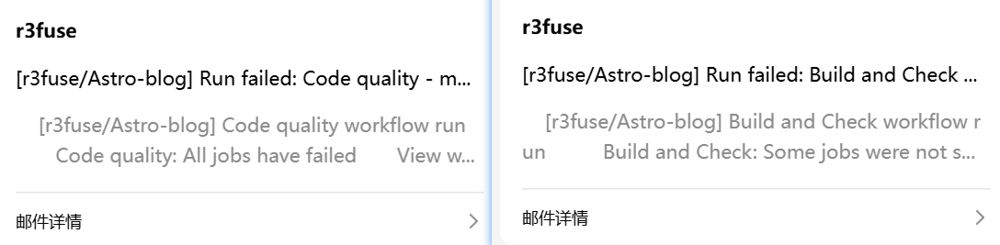
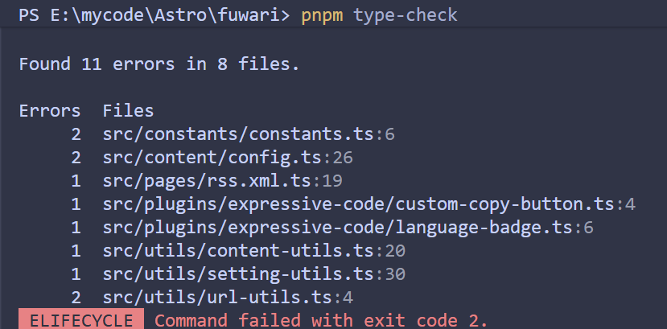
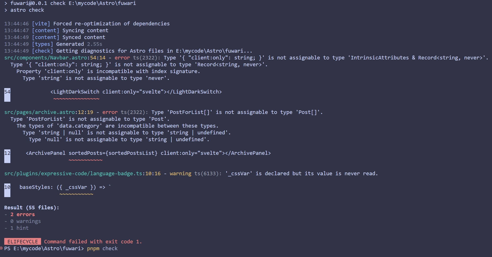
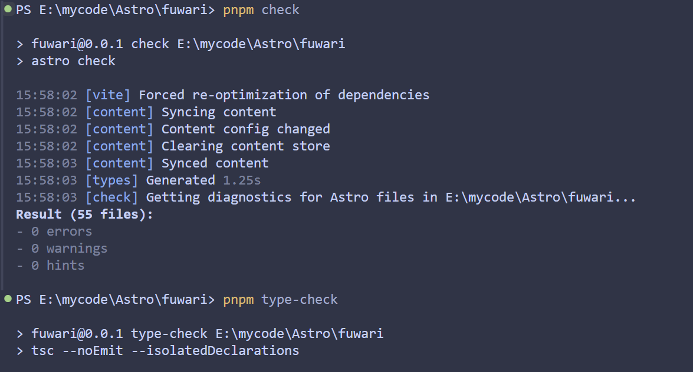

第一次用Astro搭建博客，看中了个叫[fuwari](https://github.com/saicaca/fuwari)的主题，就clone下来部署。
按照文档pnpm install然后pnpm dev。本地构建没问题，但是在github的Actions构建时，Code quality和Build and Check就老是failures。其实这没什么，但是只要一出错，github 工作流那边就会发邮件报告failures给我。想到每次发文章都会触发这个，于是我尝试着修一下。

## Fix ts报错
既然是github Actions触发的，那么就先看.github/workflows下的文件，找到了一个名为build.yml文件
```yml
#build.yml
check:
    steps:
        - name: Run Astro Check
          run: pnpm astro check
```
所以push上去工作流会自动执行**pnpm astro check**
视角再转到package.json
```json
#package.json
"scripts": {
  "dev": "astro dev",
  "start": "astro dev",
  "check": "astro check",
  "build": "astro build && pagefind --site dist",
  "preview": "astro preview",
  "astro": "astro",
  "type-check": "tsc --noEmit --isolatedDeclarations",
  "new-post": "node scripts/new-post.js",
  "format": "biome format --write ./src",
  "lint": "biome check --write ./src",
  "preinstall": "npx only-allow pnpm"
},
```
根据**build.yml** 和 工作流的报错，不难看出每次push上去都会执行 **pnpm check** 和 **pnpm type-check**。我们本地运行脚本试一下。果然



### 解决方法一
解决掉提出问题的人,修改**package.josn**中的**type-check**，
```json
#package.json
  "scripts": {
    "type-check": "tsc --noEmit",
  },
  ```

### 解决方法二
TypeScipt报的错误都是文件的函数没有显式的写出返回值类型。只要在每个报错的文件里的函数写上返回值类型就好。对比下面的代码修改一下就好。

```typescript
#src/constants/constants.ts
export const LIGHT_MODE = "light";
export const DARK_MODE = "dark";
export const AUTO_MODE = "auto";
export const DEFAULT_THEME: typeof AUTO_MODE = AUTO_MODE;

export const BANNER_HEIGHT_HOME: number = BANNER_HEIGHT + BANNER_HEIGHT_EXTEND;
```

```typescript
#src/content/config.ts
export const collections: Record<
	string,
	ReturnType<typeof defineCollection>
> = {
```

```typescript
#src/pages/rss.xml.ts
export async function GET(context: APIContext): Promise<Response> {
```

```typescript
#src/plugins/expressive-code/custom-copy-button.ts
export function pluginCustomCopyButton(): ReturnType<typeof definePlugin> {
```

```typescript
#src/plugins/expressive-code/language-badge.ts
export function pluginLanguageBadge(): ReturnType<typeof definePlugin> {
	return definePlugin({
		name: "Language Badge",
        baseStyles: () => `
      [data-language]::before {
        position: absolute;
        z-index: 2;
```

```typescript
#src/utils/content-utils.ts
export async function getSortedPosts(): Promise<CollectionEntry<"posts">[]> {
```

```typescript
#src/utils/setting-utils.ts
export function applyThemeToDocument(theme: LIGHT_DARK_MODE): void {
```

```typescript
#src/utils/url-utils.ts
export function pathsEqual(path1: string, path2: string): boolean {
```

```typescript
#src/utils/url-utils.ts
export function url(path: string): string {
```


## Fix astro check时的报错

```svelte
#src/components/ArchivePanel.svelte
export let tags: string[] = [];
export let categories: string[] = [];

const params = new URLSearchParams(window.location.search);
	data: {
		title: string;
		tags: string[];
		category?: string;
		category: string | null;
		published: Date;
	};
}
```
```svelte
#src/components/LightDarkSwitch.svelte
let mode: LIGHT_DARK_MODE = AUTO_MODE;
panel?.classList.remove("float-panel-closed");
panel?.classList.add("float-panel-closed");
```


这些都修改完后再执行**pnpm check** 和 **pnpm type-check**还有**pnpm format**格式化代码就能顺利通过，github Actions那边也不会有问题。




## 总结
仓库作者使用--isolatedDeclarations会导致每个声明文件独立生成，不依赖其他文件，所以ts在检查类型时发现没有显式标注类型会报错。svetle部分就是svetle4和svetle5混用了。